# 导航中心

简洁美观的个人导航中心网站。

&gt; 本项目基于 [iori-nav](https://github.com/jy02739244/iori-nav) 为基础开发，部分功能受 [CloudNav-Oorz](https://github.com/oorzc/CloudNav) 启发，由 [KIMI](https://kimi.moonshot.cn)主导技术实现。

---

## 🌐 在线体验

https://navhub.niceone2.ccwu.cc

---

## 🖼️ 效果预览
（本项目基于[iori-nav](https://github.com/jy02739244/iori-nav) 为基础开发，预览效果借用原项目，在此表示致谢！）

| 风格一 | 风格一 |
| :---: | :---: |
| 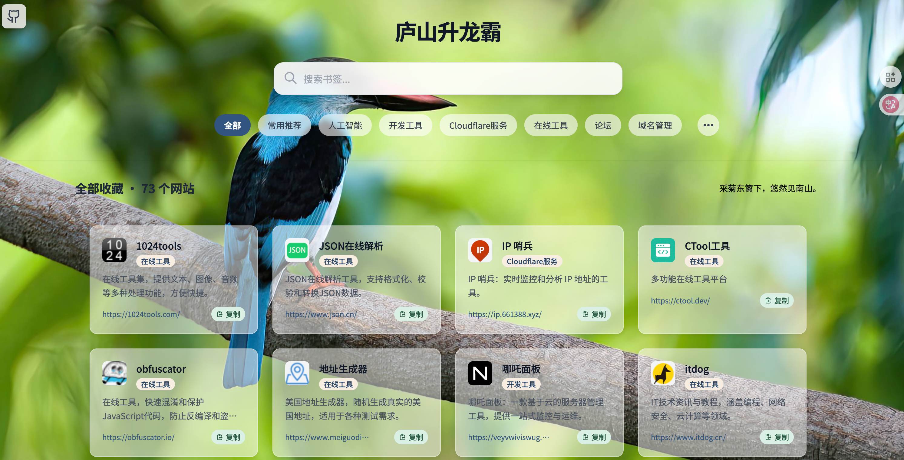 | 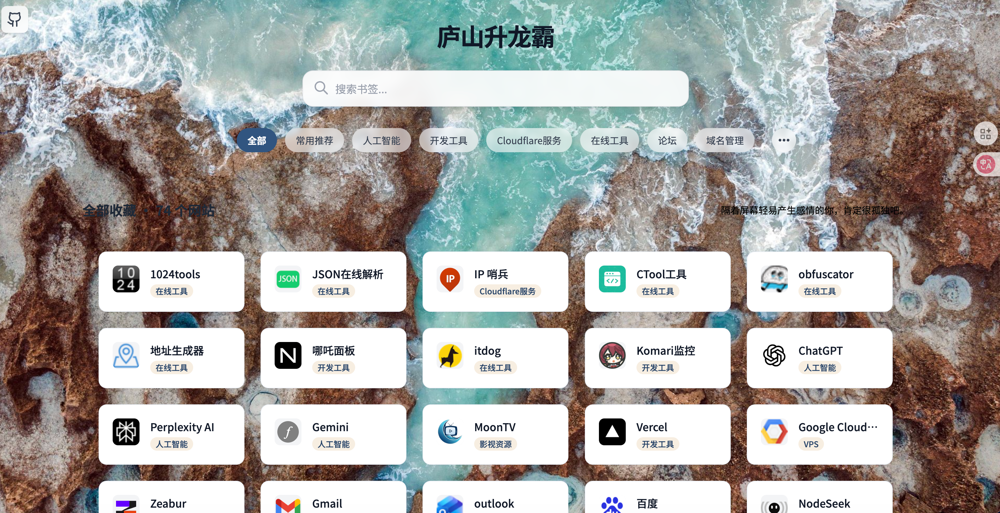 |

| 风格二 | 风格三 |
| :---: | :---: |
| 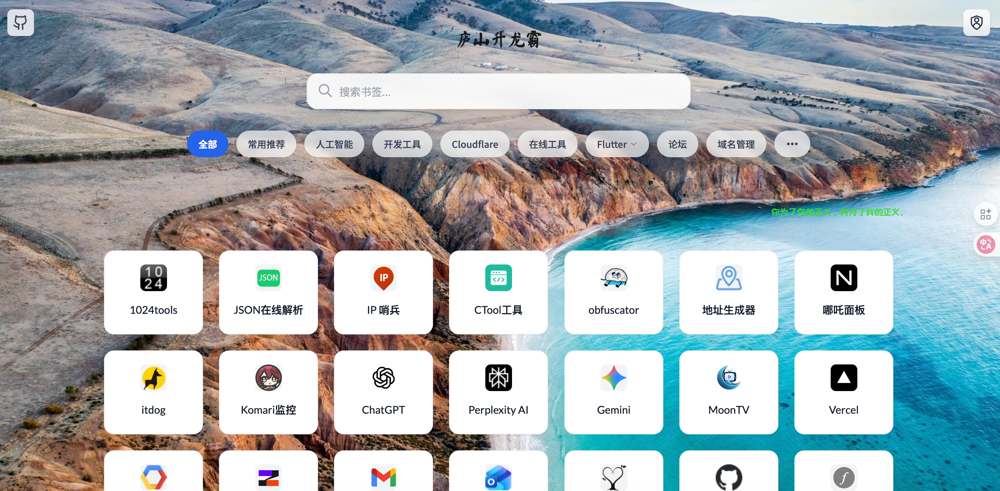 | 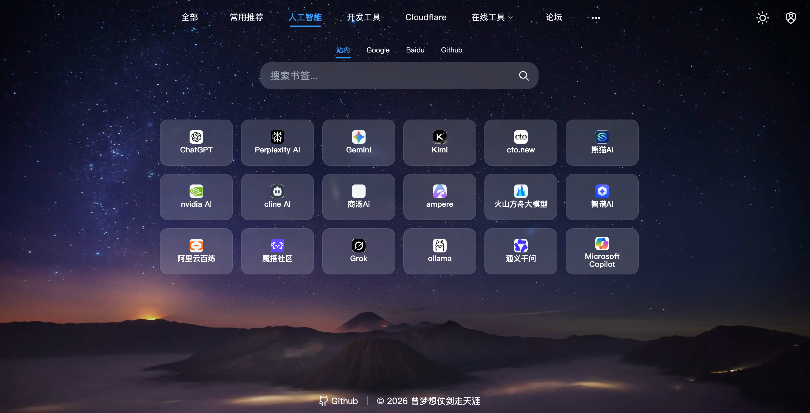 |

| 桌面设置界面 | 移动设置界面 |
| :---: | :---: |
|  | 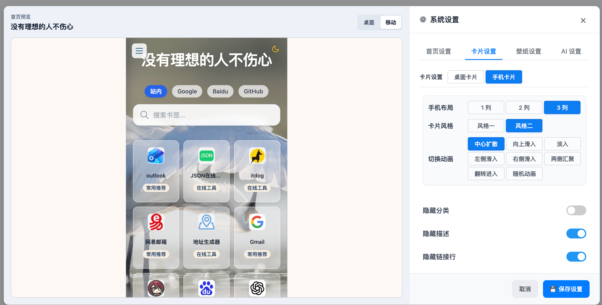 |

后台设置页支持分别配置桌面端与手机端卡片，包括卡片列数、卡片风格、切换动画、是否隐藏描述/链接行/分类、毛玻璃效果、圆角以及标题和描述的字体样式。后台设置页面为 URL 后加 `/admin`。

| 手机端风格一 | 手机端风格二 | 手机端风格三 |
| :---: | :---: | :---: |
| 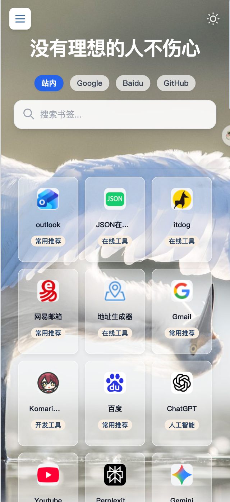 |  |  |

> 💡 手机端可独立设置 1/2/3 列布局，并根据卡片密度自动优化复制按钮显示；卡片的毛玻璃效果和程度也可以在后台设置里自定义。

---

## ✨原项目[iori-nav](https://github.com/jy02739244/iori-nav)  核心特性

| 特性 | 说明 |
| :--- | :--- |
| 📱 **响应式设计** | 完美适配桌面、平板和手机等各种设备 |
| 🎨 **主题美观** | 界面简洁优雅，支持自定义主色调与夜间模式 |
| 🔍 **快速搜索** | 内置站内模糊搜索，迅速定位所需网站 |
| 📂 **分类清晰** | 通过多级分类组织书签，浏览直观高效 |
| 🔒 **安全后台** | 基于 KV 的管理员认证，提供完整的书签增删改查后台 |
| 📝 **用户提交** | 支持访客提交书签，经管理员审核后显示（可通过环境变量关闭） |
| ⚡ **性能卓越** | 利用 Cloudflare 边缘缓存，秒级加载，节省 D1 数据库读取成本 |
| 📤 **数据管理** | 支持书签数据的导入与导出，兼容 Chrome 导出的 HTML 格式 |

---

## 🔄 原项目[iori-nav](https://github.com/jy02739244/iori-nav) 版本亮点

- 🛡️ **后台会话安全升级**：登录 `/admin` 后将颁发 HttpOnly 会话 Cookie（默认 1 天，可选 1/7/30/60/90 天），凭据不再暴露在 URL 中，并新增一键退出登录。
- 🧹 **输入与展示双重校验**：新增 URL 规范化、HTML 转义与排序值归一化逻辑，前后台同时防止脏数据和潜在 XSS。
- 🔐 **访客投稿可控**：通过 `ENABLE_PUBLIC_SUBMISSION` 环境变量即可关闭前台投稿入口，相关接口自动返回 403。
- 🤖 **AI 一键自动生成描述**：提供 Workers AI、Google Gemini 和 OpenAI 接口。
- 🖼️ **Logo 自动生成**：默认使用 [faviconsnap.com](https://faviconsnap.com) 接口，可在环境变量中自定义。
- 📦 **导入导出数据**：提供书签数据的导入与导出，支持 Chrome 导出的 HTML 格式一键导入。

## ✨ 本项目[NavHub](https://github.com/Yu-Home01/NavHub) 在原项目基础上新增以下功能

- **Favicon URL 自定义** — 支持自定义网站图标，支持本地图片上传，使标签页更具个性化
- **GitHub 链接自定义** — 导航页页脚 GitHub 图标链接可自定义配置
- **置顶/常用分类** — 支持将书签归档于各自分类并同时可以置顶显示，置顶书签可以后台排序
- **桌面端侧边栏抽屉式设计** — 桌面端启用侧边栏时，点击分类标签或刷新，侧边栏会自动收起，展现更优雅的桌面端交互体验
- **必应搜索** — 集成必应搜索引擎
- **天气组件** 🌤️ — 开发中......

---

## 🚀 快速部署

## 基于 Cloudflare 全家桶（Pages + Workers + D1 + KV），零服务器成本。 ##

### 1. Fork 本仓库

点击右上角 ⭐ Star，再点击 **"Fork"** 按钮，将仓库复刻到你的 GitHub 账号下。

### 2. 连接 Cloudflare Pages

点击上方按钮跳转到 Cloudflare，然后选择连接到 GitHub，授权后选择刚才 Fork 的项目。（如下图）

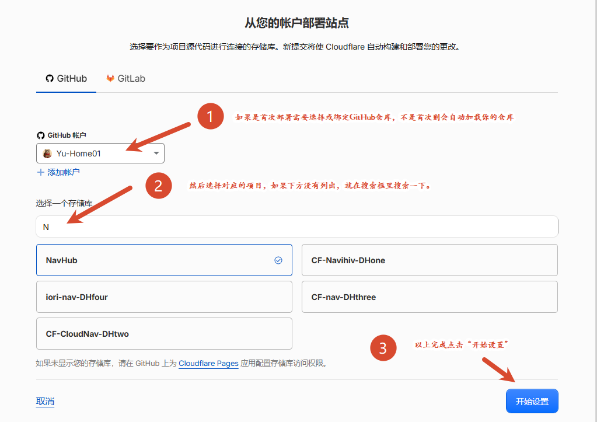

项目名称可以自定义（如 `navhub`），生产分支选`main`，框架预设：选 `None`或 `无`，构建命令：留空，输出目录：填 `public`，最后点击 **保存并部署**。（如下图）

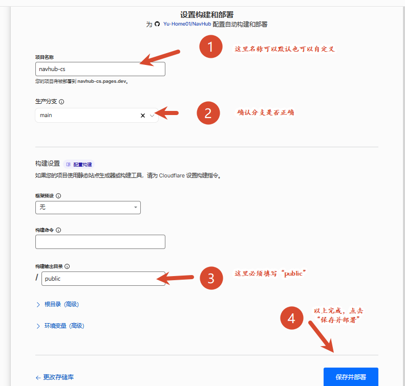

### 3. 创建 D1 数据库

1. 在 Cloudflare 页面左侧，点击 **存储和数据库** → **D1 SQLite 数据库**
2. 点击右上角 **创建数据库**，名称可自定义（如 `navhub-d1`）。（如下图）

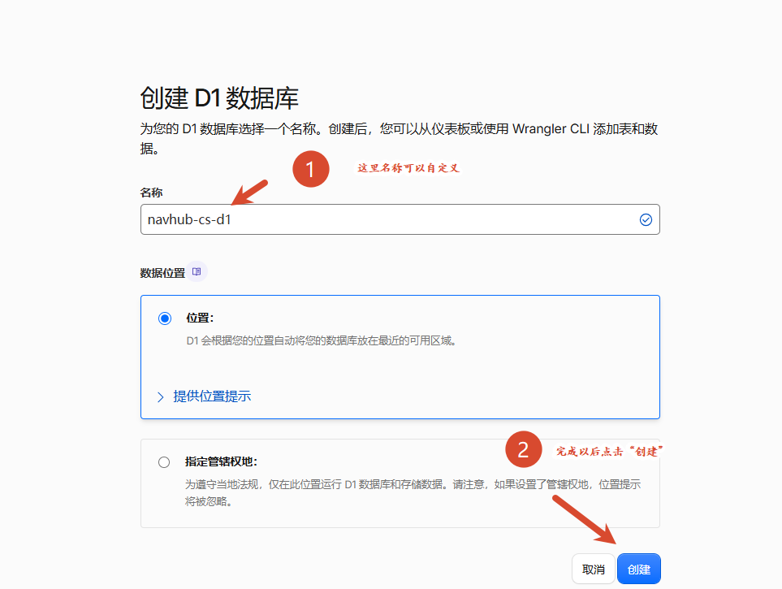

### 4. 创建 KV 命名空间

1. 在 Cloudflare 页面左侧，点击 **存储和数据库** → **Workers KV**
2. 点击右上角 **Create Instance**，名称可自定义：（如 `navhub-kv`）。（如下图）

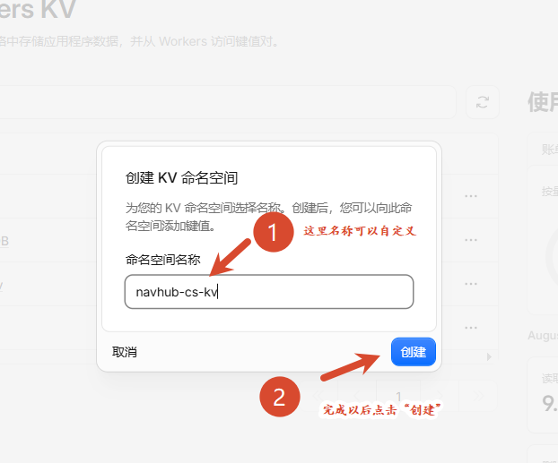

3. 创建完成以后会自动来到“KV 对”页面，添加两个条目，用于设置管理后台的 用户名 和 密码。（如下图）
   -第一条：密钥框输入`admin_username`  值：（可自定义）【这个就是后台管理员的用户名】
   -第二条：密钥框输入`admin_password`  值：（可自定义）【这个就是后台管理员密码】

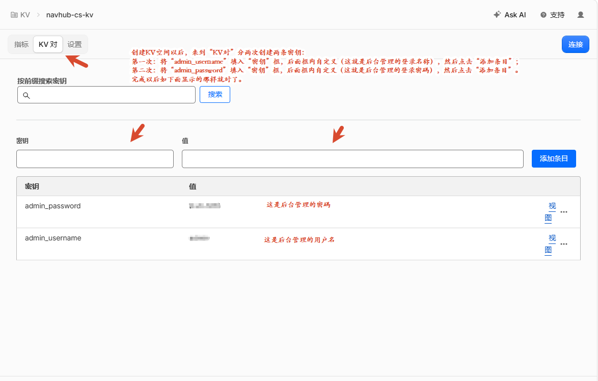  

### 5. 绑定 D1 数据库和 KV 命名空间
1. 在 Cloudflare 页面左侧，点击**计算** → **Workers & Pages**
2. 点击刚刚创建的 Pages 项目（如 `navhub`） → **设置** → 找到下方**绑定** → 点击右侧**添加**：
   -选择 D1 数据库： 变量名称填`NAV_DB`，点击下方框内选择刚刚创建的D1数据库（如 `navhub-d1`），然后点击**保存**（如下图）

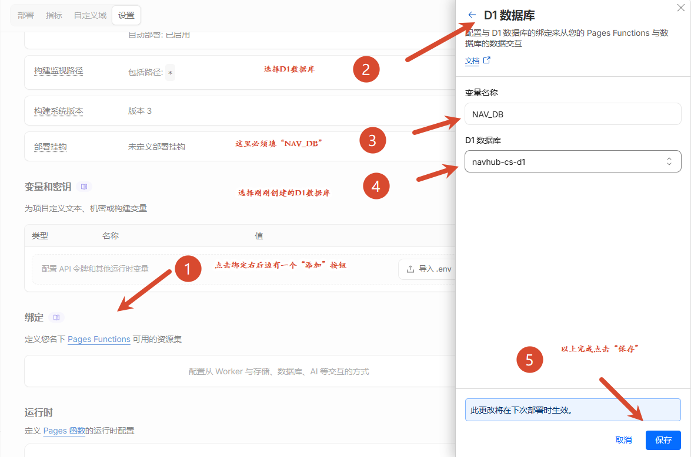

   -继续**添加**选择 KV 命名空间：变量名称填`NAV_AUTH`，点击下方框内选择刚刚创建的KV 空间（如 `navhub-kv`），然后点击**保存** （如下图）

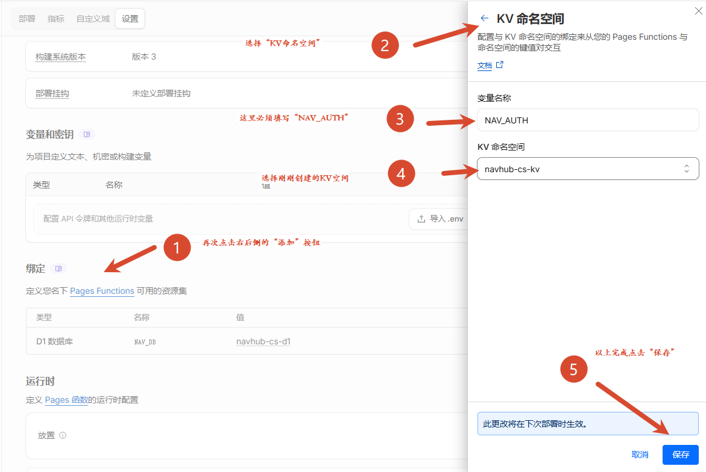

   -（可选项，非必须）继续**添加**选择 Workers AI：变量名称填`AI`，然后点击**保存** (如下图）

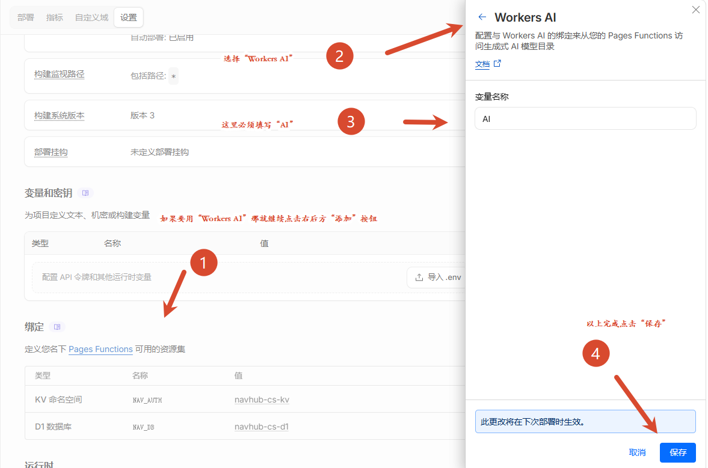

  -以上都绑定完成以后的页面 （如下图）

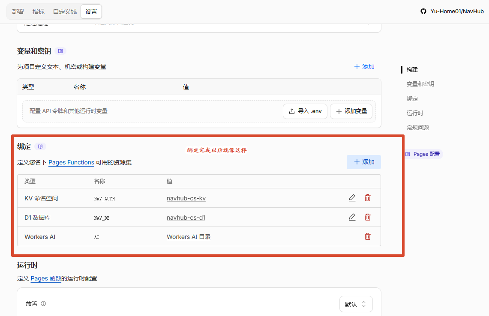

### 6. 重新部署

完成以上步骤以后，点击Pages 项目 → **部署** → 点击项目最后一次部署条目后面的三个点··· → **重试部署**，等待部署完成即可用 Cloudflare 分配的 Pages 域名访问。（如下图）

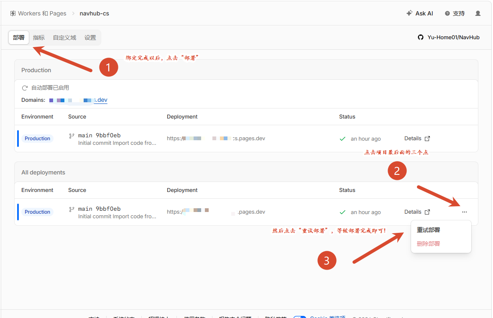

### 7. 绑定域名

最后绑定自己的域名，使项目独具个性，更便于访问：
点击Pages 项目 → **自定义域** → **设置自定义域** （如下图）

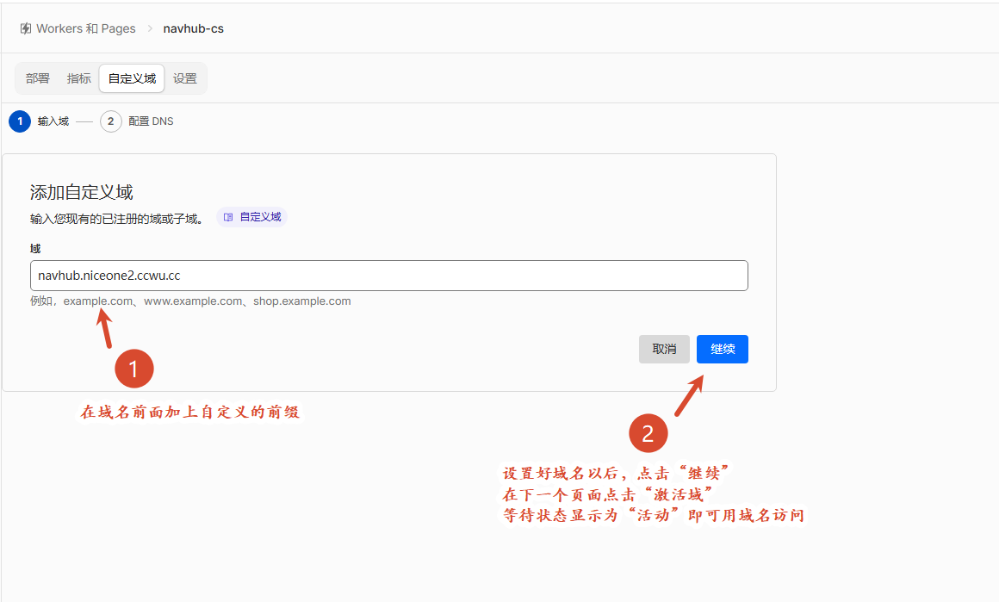

---

## 🔧 环境变量

| 变量名 | 说明 | 必填 |
|--------|------|------|
| `NAV_DB` | D1 数据库绑定 | 是 |
| `NAV_AUTH` | KV 存储绑定 | 是 |

---

## 🛠️ 技术栈

- **前端**：原生 HTML + CSS + JavaScript
- **后端**：Cloudflare Workers
- **数据库**：Cloudflare D1
- **缓存**：Cloudflare KV
- **部署**：Cloudflare Pages

---

## 📝 更新日志

### v1.0.0
- 独立仓库发布
- 新增置顶/常用分类功能
- 新增侧边栏抽屉式设计
- 新增必应搜索
- 新增自定义头像和 Favicon
- 运行时自动数据库迁移
- 更新README.md

---

## 📄 许可证

本项目采用 [MIT](LICENSE) 许可证。

---

## 🙏 致谢

- [iori-nav](https://github.com/jy02739244/iori-nav) — 原始项目
- [CloudNav-Oorz](https://github.com/oorzc/CloudNav) — 参考项目
- [KIMI](https://kimi.moonshot.cn)— 主导技术实现与功能开发

---

## 📞 联系方式

- **项目作者**：[@Yu](https://github.com/Yu-Home01)
- **项目链接**：[https://github.com/Yu-Home01/NavHub](https://github.com/Yu-Home01/NavHub)

如果你喜欢这个项目，请给它一个 ⭐️！

